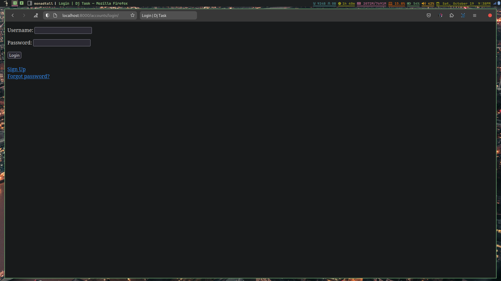
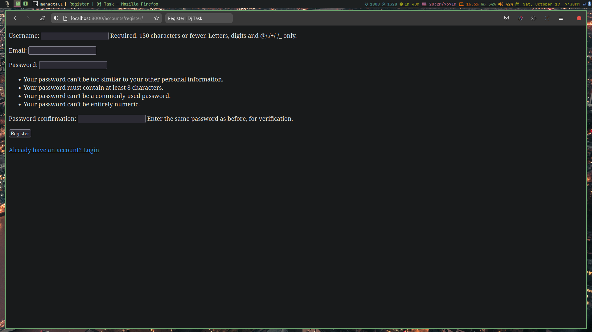
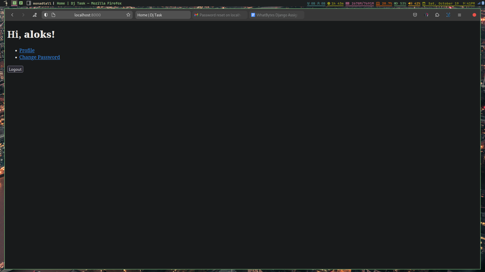
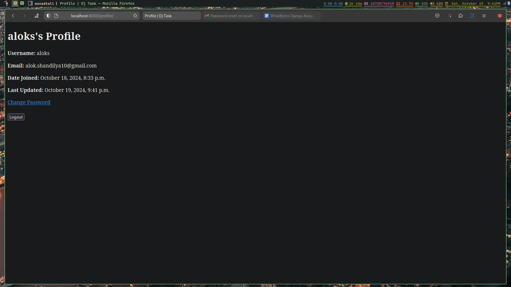
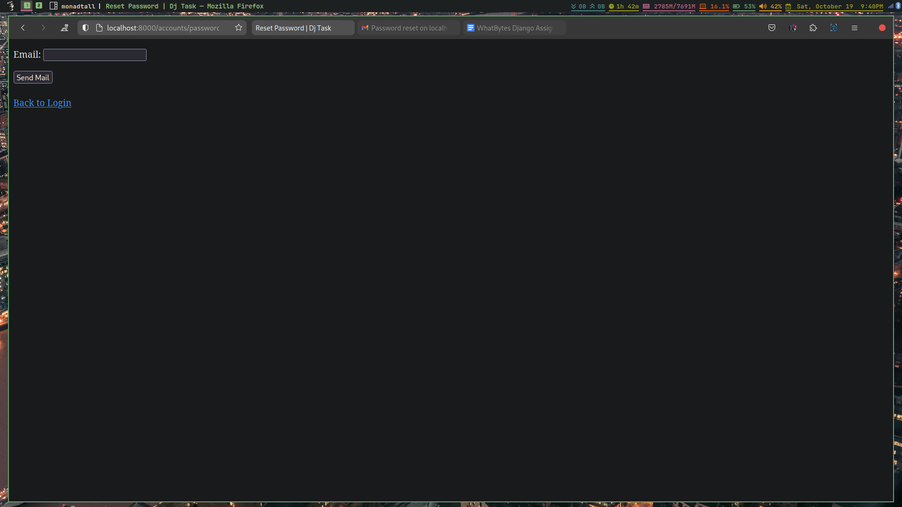
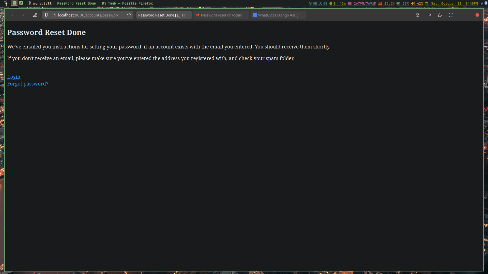
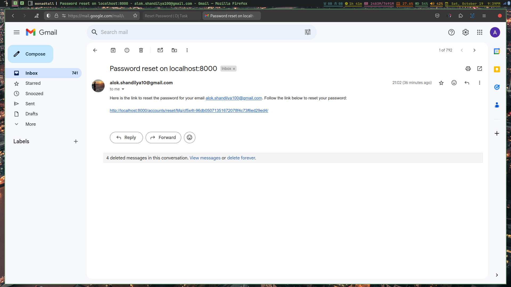

# Django Auth Task

## Task Description

Create a Django authentication system with the following requirements:

1. Login Page
2. Sign Up Page
3. Forgot Password Page
4. Change Password Page
5. Dashboard Page
6. Profile Page

## Implementation

Use Django's built-in authentication (User model), built-in forms, and built-in
views to implement the above requirements.

- custom views for:
  - Registration: `RegisterForm`, `registeration_view`
  - Index: `index`
  - Profile: `profile` (_@login_required_)

## How to run

- 3 step process to run the project:
  - Clone the repository
  - Install the requirements
  - Run the server

```bash
git clone https://github.com/alokshandilya/django-auth
cd django-auth
# create a virtual environment and activate it (optional)
# python -m venv .venv
# source .venv/bin/activate (linux)
# .venv\Scripts\activate (windows)
pip install -r requirements.txt
python manage.py runserver
```

## Screenshots

<p align="center">
  
  
</p>
<p align="center">
  
  
</p>
<p align="center">
  
  
  
</p>
